# Comandos Git

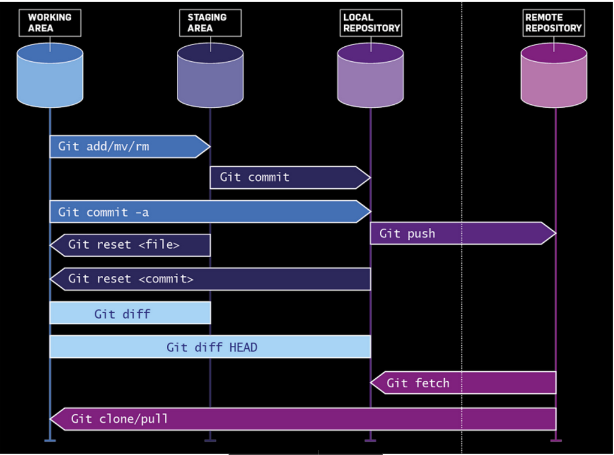

## Configurar entorno Git

Configuracion de Usuario Global:

```git config --global user.name "Luxa Paz"```

```git config --global user.email "tu-correo@example.com"```

```git config --list```

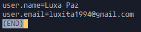

Para finalizar la ejecucion de `git config --list` presionamos la letra `Q`.

## Comandos basicos

### Repositorio local

- Para iniciar un repositorio local usamos:

```git init```

Ejemplo `git init`:

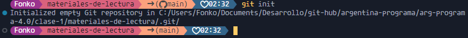

- Para verificar si hay cambios por realizar:

```git status```

Ejemplo `git status`:

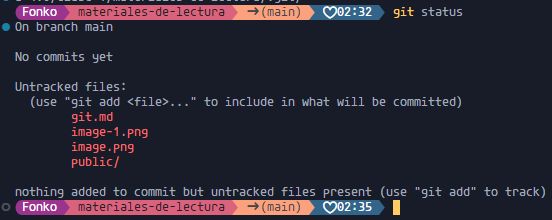

- Para agregar los cambios en el repositorio local:

```git add . (con el . agregamos todos los archivos que fueron creados/modificados/borrados)```

Ejemplo `git add.` y `git status`:

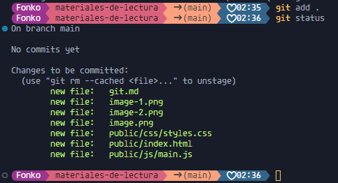

- Para confirmar los cambios en el repositorio loca:

```git commit -m "Aca va un mensaje"```

Ejemplo de `git commit`

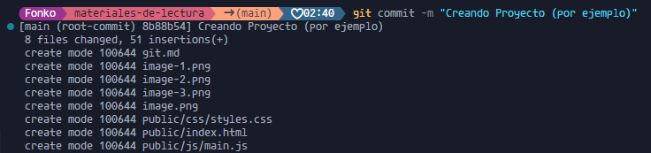

### Repositorio Remoto

- Si tenemos cuenta en `Github`, creamos un repositorio remoto:

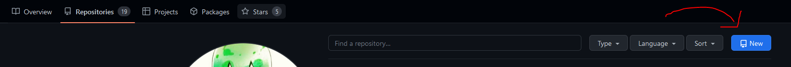

- Creamos el titulo de nuestro Repo Remoto, seleccionamos el tipo de privacidad y creamos repositorio:

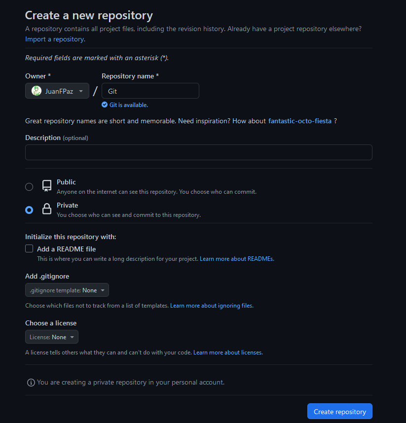

- El mismo `Github` nos dice que hacer. Nos da instrucciones de como crear un repositorio local como vimos anteriormente y agregar el repositorio remoto. Y las otras instrucciones es directamente para agregar el repositorio remoto:

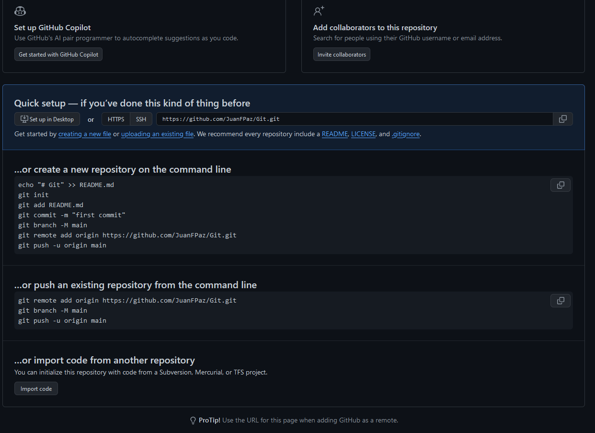

- Para agregar nuestro repositorio remoto a nuestro repositorio local:

```git remote add origin https://github.com/<nombre-de-usuario>/<nombre-de-repositorio>.git```

Ejemplo de `git remote`


- Este paso es opcional pero es bueno saberlo. Si tu rama principal se llama `master`, le cambias el nombre a `main`:

```git branch -M main```

Para verificar si tu rama principal se llama `main` o `master`, podes visualizarlo con el comando `git branch`.

Ejemplo:

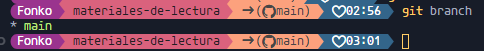

En este ejemplo `main` es la rama principal al ser la unica que hay.

Si esta en verde y con un asterisco, significa que es la rama actual en la que te encontras.

- Para subir los cambios confirmados (los `git commit`) al repositorio remoto:

```git push origin main```

Ejemplo `git push`

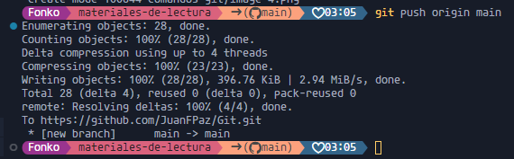

- Se actualiza nuestro repositorio remoto de `Github` una vez subido los cambios :


