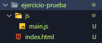
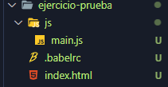
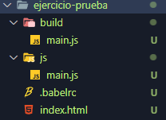
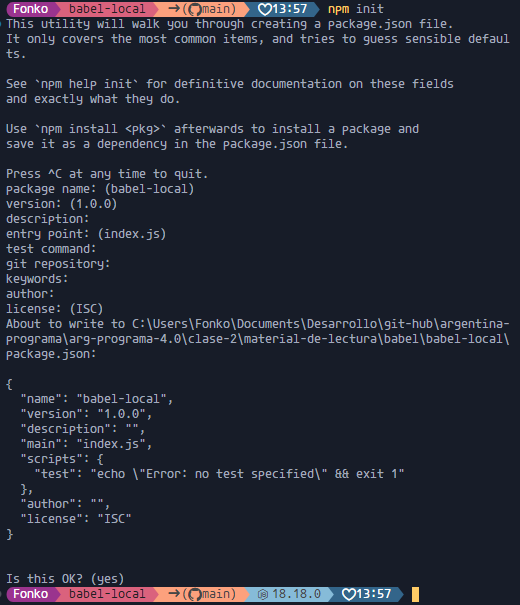
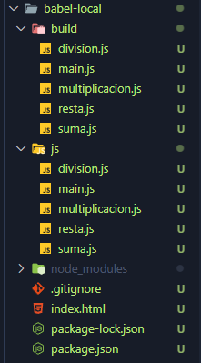

# Babel

## ¿Que es Babel?

[Fuente: Freecodecamp.org](https://www.freecodecamp.org/espanol/news/que-es-babel/)

`Babel` es un transpilador para `Javascript`. Basicamente nos permite transformar codigo escrito con las ultimas y novedosas caracteristicas y transformarlo en un codigo que sea entendido por navegadores más antiguos.

Como `Javascript` es un lenguaje que esta en constante y cada año se agregan nuevas caracteristicas a su estandar (`ECMAScript`).

Lamentablemente la velocidad de actualizacion del estandar no es la misma que la velocidad de adopcion de los navegadores. Los navegadores no siempre pueden implementar nuevas caracteristicas en sus motores ni hacerlo retrocompatibles con versiones antiguas. Tampoco es posible que todos los usuarios usen navegadores actuales, lo que limita la posibildiad de tener la seguridad de poder usar las nuevas caracteristicas del lenguaje en todas partes.

La solucion a este problema es instalar `Babel` y poder usarlo para **transpilar** nuestros codigos.

## Instalar Babel

Para instalar `Babel`, primero debemos tener **instalados NodeJs** en nuestro ordenador.
Si ya tenemos instalado `NodeJs`, nos dirigimos a nuestra terminal de comandos y ejecutamos el siguiente comando para instalarlo de manera global:

``` npm install --global babel-cli ```

Luego ejecutamos el `preset` para tener la compatibilidad con `ES2015` (que corresponde a la version de `ES6`).

``` npm i -D babel-preset-es2015 ```

Ahora nos podemos dirigir a un directorio donde estemos trabajando con un proyecto de Javascript, y utilizar el **transpilador**.

Por ejemplo para empezar, en este mismo directorio vamos a ver una carpeta llamada `ejercicio-prueba`.



Dentro contiene un documento `HTML` y un subdirectorio `js`. El codigo `Javascript` contiene sintaxis del estandar `ES6`:

- Contiene una variable `let`.
- Contiene una constante (`const`).
- Contiene un `Templeta String`.
- Contiene una `Arrow Function`.

```js
function suma(a,b,callback){
    let c = a + b;
    callback(c);
}

suma(5,6,(c)=>{
    console.log(`El resultado de la suma es ${c}`);
});
```

Para poder transpilar este codigo `Javascript` a `ES5`, primero tenemos que crear un archivo con la extension `.babelrc` en el directorio donde estamos trabajando (en este caso **ejercicio-prueba**)y dentro le colocamos la siguiente linea de codigo:

```json
{
    "presets": ["es2015"]
}
```



Finalmente, ya podemos **transpilar** nuestro codigo creamos una nueva carpeta llamada `build` donde vamos a guardar los codigos transpilados,y luego ejecutamos en nuestra terminal de `Visual Studio Code` el siguiente comando: (asegurate que tu terminal de `Visual Studio Code` este en el directorio donde vos queres realizar la **transpilacion**)

``` babel js/main.js -o build/main.js ```

Cuando ejecutamos este comando, le pasamos primero el archivo `Javascript` ubicado en la carpeta `js` que queremos transpilar, luego le indicamos a `Babel` donde queremos alojar el nuevo archivo `js` que va a transpilar con el `-o` y seguido del nombre del archivo con la ubicacion donde lo vamos a guardar, que en esta caso es `build/main.js`. El nombre del fichero puede ser cualquiera, no es necesario que se llame igual al que estamos transpilando.



Ahora que tenemos creado nuestro archivo, vamos a ver lo siguiente:

```js
"use strict";

function suma(a, b, callback) {
    var c = a + b;
    callback(c);
}

suma(5, 6, function (c) {
    var parrafo = document.getElementById("resultado");
    parrafo.innerHTML = "El resultado de la suma es " + c;
});
```

Vemos que con `ES5` nuestro archivo `js` tiene:

- El `"use strict"` al inicio del codigo.
- Usa `var` para declarar variables en vez de `let` y `const`.
- Usa una `funcion anonima` en vez de `arrow function`.

Ahora para finalizar, podemos agregar este `script` en nuestro documento `HTML`, consiguiendo asi, la **retrocompatbilidad** que habiamos mencionado al principio.

```html
<!DOCTYPE html>
<html lang="es">
<head>
    <meta charset="UTF-8">
    <meta name="viewport" content="width=device-width, initial-scale=1.0">
    <title>Ejemplo de Babel</title>
</head>
<body>
    <h1>Ejemplo de codigo transpilado:</h1>
    <p id="resultado"></p>
    <script src="build/main.js"></script>
</body>
</html>
```

## Como implementar Babel Local en nuestro proyecto

La forma que vimos recien, fue instalar, e implementar `Babel` de forma global. A continuacion, vamos a ver como instalarlo de forma local, es decir que solo funcione en un proyecto. Lo que vamos a hacer en este paso es iniciar el comando `npm init` (`Es importante tener instalado NodeJs para realizar estos pasos.`).

En nuestra terminal nos va a hacer una serie de preguntas, por el momento solamente presionamos `Enter` hasta finalizar con la configuracion.



Esto nos genera un archivo llamado `package.json`, generando un modulo `npm` (`Node Package Manager`). Con esto ahora podemos instalar `Babel` de forma local para esta area de trabajo (`Directorio.`). En la terminal utilizamos `npm install --save-dev babel-cli`. Cuadno ejecutamos este comando, se nos genera un directorio llamado `node_modules`, y que contiene toda las dependencias que utilazamos en nuestros proyectos donde utilizamos `Node`, entre ellos esta `Babel`.

Cuando se termina de hacer la instalacion, en `package.json` aparece en la seccion `devDependencies`, la dependencia de `Babel` instalado recientemente:

```json
{
  "name": "babel-local",
  "version": "1.0.0",
  "description": "",
  "main": "index.js",
  "scripts": {
    "test": "echo \"Error: no test specified\" && exit 1"
  },
  "author": "",
  "license": "ISC",
  "devDependencies": {
    "babel-cli": "^6.26.0" //Esto es lo que instalamos con npm install --save-dev babel-cli
  }
}
```

Ahora tenemos que configurar el `preset` de babel en nuestro `package.json`, utilizando el comando `npm i -D babel-preset-es2015`.

Cuando se termine de instalar, nuevamente en nuestro `package.json` en las dependencias de desarrollo, aparecera el `babel-preset-es2015`, lo que nos permite realizar las transpilaciones en este proyecto local. Y antes de finalizar este paso, tenemos que agregar es la configuracion de `babel` con el preset de `ES2015` en el `package.json` de forma manual. Nuestro `package.json` deberia quedar asi:

```json
{
  "name": "babel-local",
  "version": "1.0.0",
  "description": "",
  "main": "index.js",
  "scripts": {
    "test": "echo \"Error: no test specified\" && exit 1"
  },
  "babel":{
    "presets":["es2015"]
  },
  "author": "",
  "license": "ISC",
  "devDependencies": {
    "babel-cli": "^6.26.0",
    "babel-preset-es2015": "^6.24.1"
  }
}
```

Por ultimo, vamos a configurar un `script` del `package.json`, para crear un atajo de la `transpilacion.` Anteriormente para realziar la transpilacion escribiamos `babel js/main.js -o build/main.js`. Lo malo de este comando, es que requiere que tengamos creada previamente una carpeta llamada `build`, pero podemos utilziar otro comando de `Babel` que nos permite directamente crear una carpeta `build` por ejemplo, y ademas transpilar todos los archivos `.js` del directorio `js`. Con el `package.json` podes creamos el siguiente atajo en los `scripts` para realizar las transpilaciones:

```json
  "scripts": {
    "build":"babel js -d build"
  },
```

Este comando, lo que le dice a `Babel` es que de la carpeta `js`, se cree un directorio `build` y que `transpile` todo los codigos `Javascript` que esten dentro. Y para ejecutar este comando, en la terminal colocamos `npm run build`. Y el resultado final seria algo como esto:


