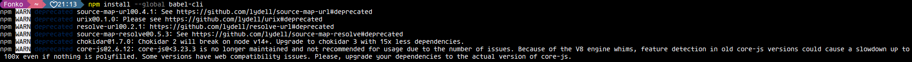
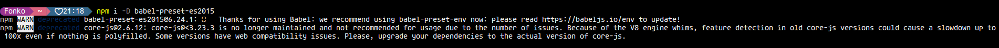

# Warns Deprecated Babel

## ejecutando `npm install --global babel-cli`

- npm WARN deprecated source-map-url@0.4.1: See <https://github.com/lydell/source-map-url#deprecated>
- npm WARN deprecated urix@0.1.0: Please see <https://github.com/lydell/urix#deprecated>
- npm WARN deprecated resolve-url@0.2.1: <https://github.com/lydell/resolve-url#deprecated>

- npm WARN deprecated source-map-resolve@0.5.3: See <https://github.com/lydell/source-map-resolve#deprecated>

- npm WARN deprecated chokidar@1.7.0: Chokidar 2 will break on node v14+. Upgrade to chokidar 3 with 15x less dependencies.

- npm WARN deprecated core-js@2.6.12: core-js@<3.23.3 is no longer maintained and not recommended for usage due to the number of issues. Because of the V8 engine whims, feature detection in old core-js versions could cause a slowdown up to 100x even if nothing is polyfilled. Some versions have web compatibility issues. Please, upgrade your dependencies to the actual version of core-js.

## ejecutando `npm i -D babel-preset-es2015`

- npm WARN deprecated babel-preset-es2015@6.24.1: 🙌  Thanks for using Babel: we recommend using babel-preset-env now: please read <https://babeljs.io/env> to update!

- npm WARN deprecated core-js@2.6.12: core-js@<3.23.3 is no longer maintained and not recommended for usage due to the number of issues. Because of the V8 engine whims, feature detection in old core-js versions could cause a slowdown up to 100x even if nothing is polyfilled. Some versions have web compatibility issues. Please, upgrade your dependencies to the actual version of core-js.

 