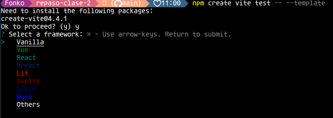
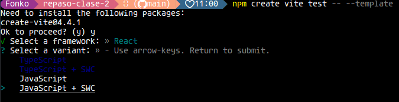
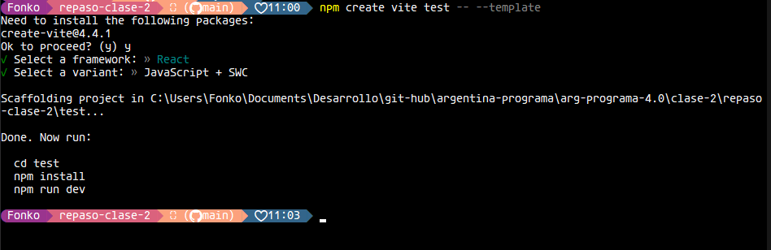
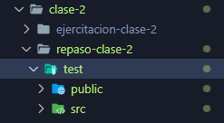
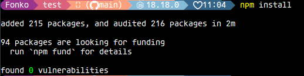
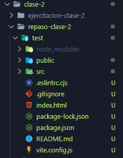

# Repaso clase 2

Estamos viendo introduccion a React.js

Fuente:[Documentacion oficial React](https://es.react.dev/)

Vamos a usar (Vite)[https://vitejs.dev/] para crear aplicaciones de react.

## Configurar entorno de desarrollo
    **Para realizar estos pasos hay que tener instalado previamente [Node.js](https://nodejs.org/en).**

Para configurar el entorno de `React.js`, debemos ejecutar el siguiente comando:
`npm create vite test -- --template` 

Seleccionamos la libreria `React`

Seleccionamos que tipo de lenguaje vamos a utilizar, entre `Typescript` y `Javascript`.

Nos dirigimos a la carpeta que corresponde y correr las instrucciones que nos indica la terminal.

Ejemplo del directorio:

Una ves en la carpeta de test, ejecutamos el comando `npm install` para instalar las dependencias de *Node-modules*

Este proceso puede demorar unos minutitos.

Al finalizar, ya tenemos el entorno para desarrollar con `React.js`

El contenido con el que vamos a trabajar, se encuentra el el directorio `src`:

