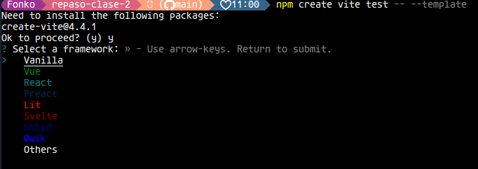
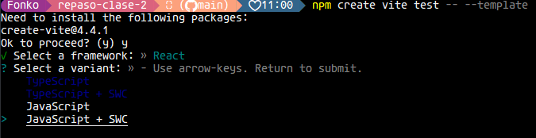
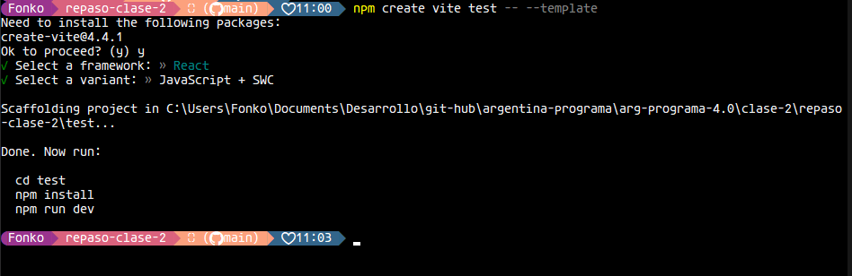
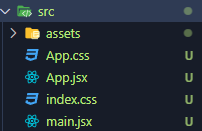

# Introduccion a React

`ReactJS` es una libreria Javascript de código abierto enfocado a la visualizacion que nos permite desarrollar interfaces de usuario dinamicas e interactivas.

Una libreria de Javascript es un conjunto de funciones y herramientas prescritas que pueden ser utilizads por desarrolladores para facilitar la creacion de aplicaciones web. Estas librerias pueden incluir funciones para manipular elementos HTML, interactuar con servidores, crear animaciones, gestionar eventos de usuarios, etc.

`React` esta basado en un paradigma llamado programacion orientada a componentes, en el que cada componente es una pieza que el usuario puede interactuar. Estos componentes estan creados en una sintaxis llamada `JSX`, que nos permite escribir HTML y JS en un mismo archivo. La principal funcionalidad de estos componentes es que son reutilizables y se combinan para crear componentes mayores hasta configurar un sitio web completo.

## Introduccion a JSX

`JSX` es una extension de sintaxis de Javascript, y que tambien nos permite escribir `HTML` en el mismo archivo. Por ejemplo:

```jsx
function UnComponente() {
  let saludo = "Hola a todos";
  return (
    <>
      <h1>{saludo}</h1>
    </>
  );
}
```

Este ejemplo es un componente basico de `React` con sintaxis `JSX`. La principal ventaja es tener mejor legibildiad del código, mejorar la experiencia de los desarrolladores y reducir la cantidad de errores de sintaxis, ya que no es necesario repetir tantas ves el mismo codigo en un archivo.

En el ejemplo visto anteriormente, tenemos un componente funcional (mas adelante profundizaremos sobre estos), que contiene una variable llamada `saludo`. Este componente tiene un `return`, y dentro envolvemos las etiquetas HTML que va a mostrar nuestro navegador, entre unos parentesis (`()`) y llaves angulares (`<>`). Tambien vamos a notar, que para mostrar nuestro saludo en HTML, solamente tenemos que envolverlo entre llaves (`{}`) y colocar el nombre de nuestra variable.

## Crear un proyecto de React

Para crear un proyecto de `React` necesitamos tener instalados previamente `Node.js` en nuestro ordenador.

Una vez que lo tengamos instalado, para crear un proyecto vamos a utilizar [Vite](https://vitejs.dev/guide/), un `Framework` que nos facilita la creacion de un entorno de desarrollo de `React` y demas tecnologias. Obvviamente por ahora, nos vamos a enfocar por `React`.

Abrimos una terminal de comandos (puede ser la de Powershell, CMD o la misma de Visua Studio Code) y ejecutamos el siguiente comando:

`npm create vite <nombre-proyecto> -- --template`

- Donde dice nombre proyecto, coloca el nombre que quieras, sin las llaves angulares (`<>`). Por ejemplo: `mi-primera-app`.

- En la terminal nos va aparece un mensaje como este, utilizando las flechas, seleccinamos la opcion `React` y preionamos enter:



- Luego, nos va a pedir que tipo de lenguaje vamos a utilizar. En este caso vamos a utilizar `Javascript + SWC`:



- A continuacion comienza a crearse el proyecto, y la terminal nos deja el siguiente mensaje para finalizar con configuracion del proyecto:



Escribe estos 3 pasos en la terminar uno por uno, mientras te comento que hace cada uno:

- `cd test`: Es un comando de la terminal que nos permite movernos entre directorios.

- `npm install`: Es un compando de `node js` que instala las dependencias para que react funcione, creando una carpeta llamado node modules.

- `npm run dev`: Es un comando de `node js` que nos permite, previsualizar nuestro proyecto, en un servidor local [http://localhost:5173/](http://localhost:5173/).

Por ultimo, nuestro ya esta creado en nuestro directorio, y seguramente veas muchos archivos que no los conozcas y te asusten al principio. No te preocupes, por ahora no vamso a profundizar con todos. Lo mas importante para comenzar, es que en la carpeta `src` se encuentran nuestros codigos `.jsx`, mencionados al principio, y con los que vamos a trabajar para desarrollar aplicaciones de React.



- `main.jsx` es el archivo principal que se conecta con el `index.html` y el archivo `App.jsx`

- `App.jsx` es archivo (o componente mejor dicho), que contiene los elementos que se visualizan en nuestra aplicacion de pruebas. Por defecto `Vite` crea una pagina inicial y que podemos previsualizarla escribiendo el comando `npm run dev`.

- `index.css` y `App.css` son simplemnte hojas de estilo de nuestra aplicacion.
