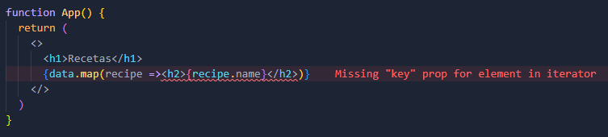
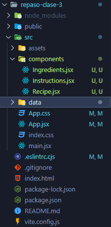
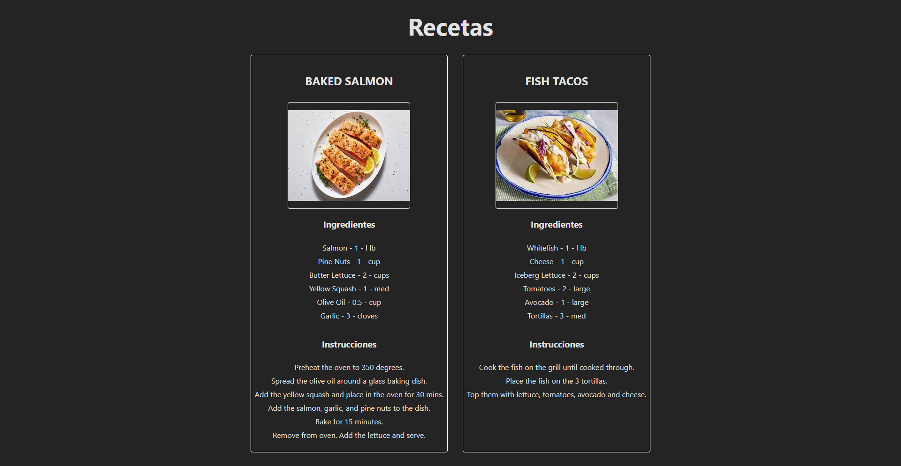

# Repaso clase 2

Vamos a ver como crear una pequeña app para continuar con ek concepto de `componentes` en **ReactJS**.

## Primer Paso

Vamos a crear un directorio llamado `data` dentro del directorio `src`. Este directorio va a contener un archivo `.js` con los siguientes datos.

```js
const pics = {
  bakedSalmon: "src/assets/BakedSalmon.jpg",
  fishTacos: "src/assets/FishTacos.jpg",
};

const data = [
  {
    id: 1,
    name: "Baked Salmon",
    pic: pics.bakedSalmon,
    ingredients: [
      { name: "Salmon", amount: 1, measurement: "l lb" },
      { name: "Pine Nuts", amount: 1, measurement: "cup" },
      { name: "Butter Lettuce", amount: 2, measurement: "cups" },
      { name: "Yellow Squash", amount: 1, measurement: "med" },
      { name: "Olive Oil", amount: 0.5, measurement: "cup" },
      { name: "Garlic", amount: 3, measurement: "cloves" },
    ],
    steps: [
      "Preheat the oven to 350 degrees.",
      "Spread the olive oil around a glass baking dish.",
      "Add the yellow squash and place in the oven for 30 mins.",
      "Add the salmon, garlic, and pine nuts to the dish.",
      "Bake for 15 minutes.",
      "Remove from oven. Add the lettuce and serve.",
    ],
  },
  {
    id: 2,
    name: "Fish Tacos",
    pic: pics.fishTacos,
    ingredients: [
      { name: "Whitefish", amount: 1, measurement: "l lb" },
      { name: "Cheese", amount: 1, measurement: "cup" },
      { name: "Iceberg Lettuce", amount: 2, measurement: "cups" },
      { name: "Tomatoes", amount: 2, measurement: "large" },
      { name: "Avocado", amount: 1, measurement: "large" },
      { name: "Tortillas", amount: 3, measurement: "med" },
    ],
    steps: [
      "Cook the fish on the grill until cooked through.",
      "Place the fish on the 3 tortillas.",
      "Top them with lettuce, tomatoes, avocado and cheese.",
    ],
  },
];
export default data;
```

Dentro de nuestro `App.jsx` importamos los datos para mostrar en lo que corresponde al dom de la `App`. Podemos corroborar los datos con un `console.log(data)`. Primero deberiamos ejecutar el entorno de desarrollo de nuestra `App` ejecutando el siguiente comando (En la terminal, tenemos que estar ubicados dentro de la carpeta donde tenemos nuestro `package.json` de nuestro proyecto creado):

`npm run dev`

La terminal nos va a brindar la `"url"` del servidor local: [http://localhost:5173](http://localhost:5173).

Ahora en nuestro archivo `App.jsx`, podemos comenzar a trabajar con los datos de las recetas:

```jsx
import data from "./data/data.js";
import "./App.css";

function App() {
  console.log(data);
  return (
    <>
      <h1>Recetas</h1>
    </>
  );
}

export default App;
```

## Mapeando los datos

En este caso, vamos a usar `map()`, una de las funcioens de los arreglos para poder obtener en un nuevo arreglo, los ingredientes de la receta y mostrarlos en el DOM.

```jsx
import data from "./data/data.js";
import "./App.css";

function App() {
  return (
    <>
      <h1>Recetas</h1>
      {data.map((recipe) => (
        <h2>{recipe.name}</h2>
      ))}
    </>
  );
}

export default App;
```

Lo malo de este metodo, es que nos va a salir un error. Este error nos solicita crear una `key` para los objetos que vamos a iterar.



Para solucionar este problema, utilizamos los `id` de los objetos que estan en nuestro archivo `data.js`, y lo identificamos y referenciamos con una `key`, para recorrer cada dato:

```jsx
import data from "./data/data.js";
import "./App.css";

function App() {
  return (
    <>
      <h1>Recetas</h1>
      {data.map((recipe) => (
        <h2 key={recipe.id}>{recipe.name}</h2>
      ))}
    </>
  );
}
```

Ahora, envolvemos nuestro `map` en un contenedor `Main`, y mejorar la iteracion de datos, guardando en un `article`, cada uno de los `recipe.name`.

Despues creamos los contenedores que van a mostrar:

- La imagen de la receta.
- Los ingredientes de la receeta utilizando un `map` (y usando los indices del arreglo como `key`).
- Las instrucciones de la receta utilizando un `map` (y nuevamente usamos los indces del arreglo como `key`).

```jsx
import data from './data/data.js'
import './App.css';

function App() {
  return (
    <>
      <h1>Recetas</h1>
      <main className="container">
        {data.map(recipe => (
            <article className='recipe' key={recipe.id}>
                <h2>{recipe.name}</h2>
                <div className = 'img-ingredientes'>
                    
                </div>
                <div className = 'ingredientes'>
                    <h3>Ingredientes</h3>
                    <ul>
                        {recipe.ingredientes.map((ing,idx) => <li key={idx}>{ing.name} - {ing.amount} - {ing.measurement}</li>)}
                    </ul>
                </div>
                <div>
                    <section className = 'instrucciones'>
                        <h3>Instrucciones</h3>
                        <ol>
                            {recipe.steps.map((step,idx) => <li key={idx}>{step}</li>)}
                        </ol>
                    </section>
                </div>
            </article>
        ))}
      </main>
    </>
  )
}
```

Esta aplicacion ya esta lsita para mostrarse en el dom, y nos permite agregar más datos en ela planilla de `data.js` y se mostraran correctamente.

Vamos a agregar algo más de estilo al sitio, en el archivo `App.css` que viene en la carpeta `src`:

```css
#root {
  margin: 0 auto;
  padding: 2rem;
  text-align: center;
}
.header {
  text-align: center;
}
.container {
  display: flex;
  gap: 2rem;
  justify-content: center;
  flex-wrap: wrap;
}
.recipe {
  width: max-content;
  display: flex;
  flex-direction: column;
  align-items: center;
  border: 1px solid white;
  border-radius: 5px;
  padding: 0.5rem;
}

.recipe h2 {
  text-transform: uppercase;
  padding: 0.5rem;
}

.img-ingredients {
  display: flex;
  padding: 1rem 0;
  border: 1px solid;
  border-radius: 5px;
  border-bottom: 1px solid white;
}

.img {
  border-radius: 5px;
  box-shadow: 2px 2px 6px;
}

.ingredients ul,
.instructions ol {
  padding: 0;
  list-style: none;
}
.ingredients li,
.instructions li {
  padding-top: 5px;
}
```

## Componentes

A continuacion vamos a crear los componentes, para separar la logica y laestructura de nuestra pequeña app y mostrar nuestras recetas.

Creamos el directorio `components` en el directorio `src`, con archivos los `Recipe.jsx`, `Ingredients.jsx` e `Instruccions.jsx`. El objetivo es que el archivo `App.jsx`, renderize los recipientes, que a su este componente `Recipe.jsx` se encargue de renderizar los ingredientes y las instrucciones:



### Componente `Recipe.jsx`

```jsx
import Instructions from "./Instructions";
import Ingredients from "./Ingredients";

export default function Recipe({ name, pic, ingredients, steps }) {
  return (
    <article className="recipe">
      <h2>{name}</h2>
      <div className="img-ingredientes">
        
      </div>
      <Ingredients ingredients={ingredients}></Ingredients>
      <Instructions title="Ingredientes:" steps={steps} />
    </article>
  );
}
```

### Componente `Ingredients.jsx`

```jsx
export default function Ingredients({ ingredients }) {
  console.log(ingredients);
  return (
    <div className="ingredientes">
      <h3>Ingredientes</h3>
      <ul>
        {ingredients.map((ing, idx) => (
          <li key={idx}>
            {ing.name} - {ing.amount} - {ing.measurement}
          </li>
        ))}
      </ul>
    </div>
  );
}
```

### Componente `Instructions.jsx`

```jsx
export default function Instructions({ title, steps }) {
  return (
    <>
      <section className="instructions">
        <h3>{title}</h3>
        <ol>
          {steps.map((step, idx) => (
            <li key={idx}>{step}</li>
          ))}
        </ol>
      </section>
    </>
  );
}
```

Finalmente, en nuestro archivo `App.jsx` deberia quedar asi:

```jsx
import data from "./data/data.js";
import Recipe from "./components/Recipe.jsx";
import "./App.css";

function App() {
  return (
    <>
      <header>
        <h1>Recetas</h1>
      </header>
      <main className="container">
        {data.map((recipe) => (
          <Recipe {...recipe} key={recipe.id} />
        ))}
      </main>
    </>
  );
}
 
export default App;
```

Finalmente, nuestra `App`, deberia verse algo asi:


