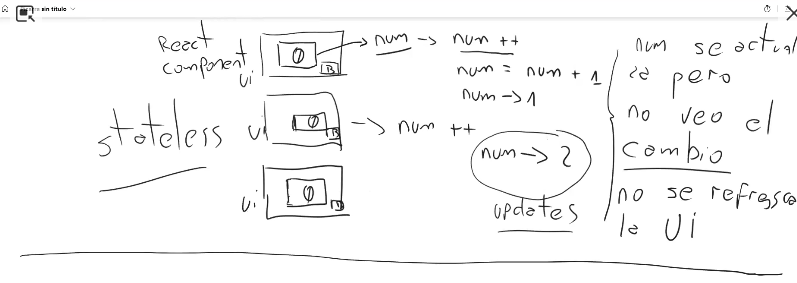
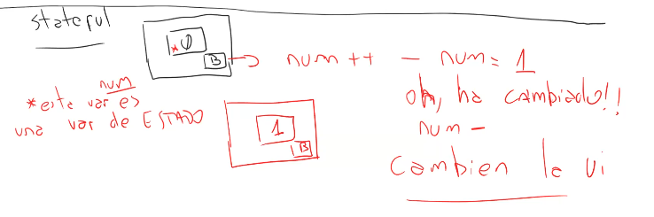
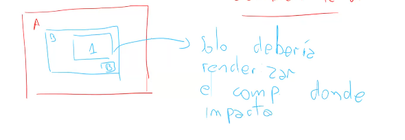
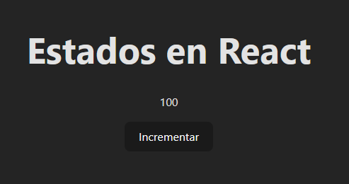
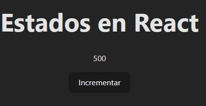

# Repaso Clase 4

En esta nueva clase, vamos a repasar lo que vimos en la [Clase 3](../../clase-3/repaso-clase-3/repaso-clase-3.md). Repasando el patron de anidacion de los componentes, y como se distribuye los datos obtenidos de la carpeta [data/data.js](../../clase-3/repaso-clase-3/src/data/data.js) por nuestros componentes.

`TODO: Hacer unos graficios y resumen de esto ^`

## Introduccion a State

- Minuto 28 Aprox...

- Minuto 34:45: Ejemplo en Stateless en react



- Minuto 36 a 38: Ejemplo de statefull



- Minuto 39: El componente que detecta el cambio en state, se renderizara.



- Crear un proyecto de react en el mismo directorio actual:

`npm init vite . -- --template react`

- Ejemplo de stateless min 52



```jsx
import './App.css'

function App(){
  console.log("Se renderiza el componente App sin un estado")
  let num = 100

  function incrementar(){
    num++;
  }

  return (
    <>
      <div className='App'>
        <h1>Estados en React</h1>
        <p>{num}</p>
        <button onClick={incrementar}>Incrementar</button>
      </div>
    </>
  )
}

export default App
```

- Introducion a Hooks, son funciones que nos permiten manejar estados en react. EL más popular es `useState` Min 52 - 55

- Importar `{useState}` Min 55



```jsx
import { useState } from 'react'
import './App.css'

function App() {
  //Ejemplo Statefull:
  console.log("Se renderiza el componente App con un estado")
  const [num, setNum] = useState(100)


  function incrementar(){
    setNum(num + 100)
  }

  return (
    <>
      <div className='App'>
        <h1>Estados en React</h1>
        <p>{num}</p>
        <button onClick={incrementar}>Incrementar</button>
      </div>
    </>
  )
}

export default App
```

- Minuto 1:02:16 Vamos a crear un ejemplo de un componente recibiendo un estado.

```jsx
//Componente button

function Button({unEvento,unaAccion}){
  return(
    <>
      <button onClick={unEvento}> {unaAccion} </button>
    </>
  )
}
```

```jsx
//Componente App

function App(){
  console.log("Se renderiza el componente App con un estado")
  const [num, setNum] = useState(100)

  function incrementar(){
    setCount(num + 100)
  }
  function decrementar(){
    setNum(num - 100)
  }

  return (
    <>
      <div className='App'>
        <h1>Estados en React</h1>
        <p>{num}</p>
        <Button unEvento={incrementar} unaAccion={Incrementar}></Button>
        <Button unEvento={decrementar} unaAccion={Decrementar}></Button>
      </div>
    </>
  )
}
```

- Vamos a crear un input, para obtener los datos de un input `:o` 1:21 (Fijate que es ese componente witness que creo el profe..)

```jsx
function InputState() {
    //Ejemplo de Stateless:
    let mensaje = ""
    function obtenerDatos(e){
        mensaje = e.target.value
    }
  return (
    <div className="App">
      <form onSubmit={(e)=>{e.preventDefault()}}>
        <label htmlFor="searchBar">Busqueda:</label>
        <input
          type="search"
          name="searchBar"
          id="searchBar"
          placeholder="Buscar..."
          onChange={obtenerDatos}
        />
      </form>
      <p>{mensaje}</p>
    </div>
  );
}

export default InputState
```

```jsx
import { useState } from "react";

function InputState() {
  //Ejemplo de Statefull:
    console.log("Se renderiza el componente InputState con un estado")
  const [mensaje, setMensaje] = useState("");

  function obtenerDatos(e){
    setMensaje(e.target.value)
  }

  return (
    <div className="App">
      <form
        onSubmit={(e) => {
          e.preventDefault();
        }}
      >
        <label htmlFor="searchBar">Busqueda:</label>
        <input
          type="search"
          name="searchBar"
          id="searchBar"
          placeholder="Buscar..."
          onChange={obtenerDatos}
        />
      </form>
      <p>{mensaje}</p>
    </div>
  );
}

export default InputState;
```

- Para esta parte del video, aplicamos lo aprendid de eventos y estados, para esperar qu el usuario ingrese un dato, y acutalizar el estado.

-Hizo un breve resumen sobre el event.target de un input.

- Para finalizar, cerro la idea mostrando como actua cada estado para un componente:

1. Podemso tener un estado para dos componentes (Por ejemplo App y Button)

2. Podemos tener un estado para un solo componente (Input)

- Para finalizar, vamos a ponerle `Bootstrap 5` a nuestros proyectos de react, leyendo la documetnacion de [react-bootstrap](https://react-bootstrap.netlify.app/docs/getting-started/introduction/)

Para instalar `react-bootstrap`, escribimos en la terminal el siguiente comando:

``` npm install react-bootstrap bootstrap ```

Una vez instalado `Bootstrap` como dependencia, tenemos que importar la hoja de estilos en nuestro archivo `App.jsx`. Recomiendo borrar las hojas de estilo pretedeterminadas de `React`, para tener una mejor experiencia probando `React-bootstrap`. De todas formas, podemso volver a agregar estilo más adelante, pero por ahora probaremos la libreria de bootstrap.

```jsx
//main.jsx
import State from './introduccion-state/State'
import InputState from './Input-state/InputState'
import 'bootstrap/dist/css/bootstrap.min.css'

function App () {
  console.log('Se renderiza el componente App con un estado')
  return (
    <main>
      <State />
      <InputState />
    </main>
  )
}

export default App
```

Al importar directamente desde la libreria descargada de `React-bootstrap`, ya no tenenmos la necesidad de insertar el link del CDN que soliamos usar en el HTML. Y con el `Javascript` ocurre algo similar, pero solamente tenemos que importar los componentes de `Bootstrap` que querramos utilizar, tal cual como nos indica en el manual de [React Bootstrap](https://react-bootstrap.netlify.app/docs/getting-started/introduction/).

Vamos a modificar el formulario que creamos recien para darle estilo

```jsx
import { useState } from 'react'
import Form from 'react-bootstrap/Form'
import Alert from 'react-bootstrap/Alert'

function InputState () {
  const [mensaje, setMensaje] = useState('')
  const [show, setShow] = useState(false)
  function obtenerDatos (e) {
    setMensaje(e.target.value)
    setShow(true)
  }

  return (
    <div className='App'>
      <Form
        onSubmit={(e) => {
          e.preventDefault()
        }}
      >
        <Form.Label htmlFor='searchBar'>Busqueda:</Form.Label>
        <Form.Control
          required
          type='search'
          name='searchBar'
          id='searchBar'
          placeholder='Buscar...'
          onChange={obtenerDatos}
        />
      </Form>
      <Alert className='mt-2' variant='light' show={show}>
        {mensaje}
      </Alert>
    </div>
  )
}

export default InputState
```

Importamos 2 componentes de Bootstrap, el componente `Form` y el componente `Alert`. A nuestro Formulario, debemos cambiarle las etiquetas, anteriomente, aunque no se note, el formulario tenia una etiqueta `form` (en minusculas). Con el componente de `Bootstrap`, nuestro formulario, va a tomar el estilo predeterminado de `Bootstrap`, ademas tambien tenemos que agregarselo al `label` y al `input`, donde este ultimo, ya no se llama input, sino que ahroa se llama `Form.Control`. Todo esto, esta en la documentacion de `React-Bootstrap`.
